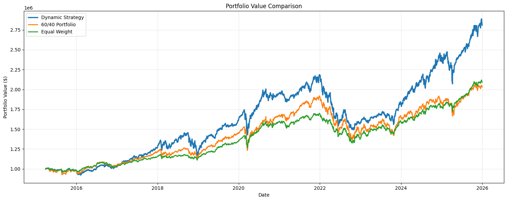
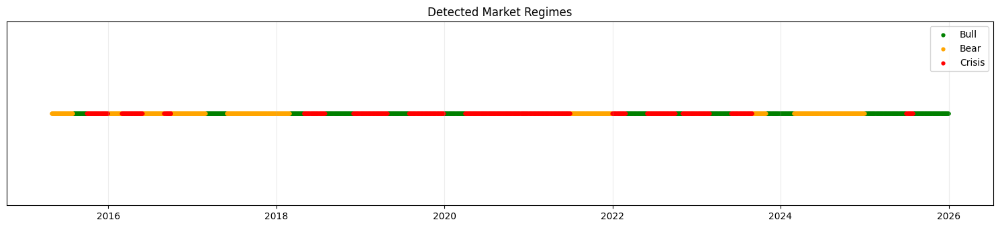
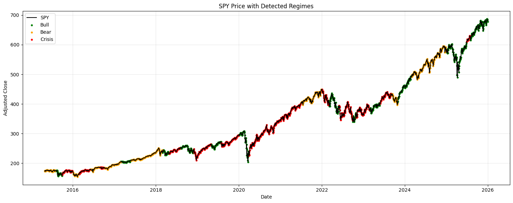
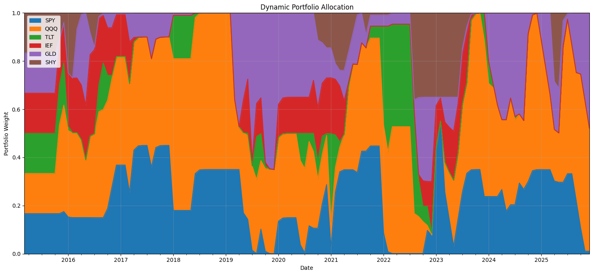
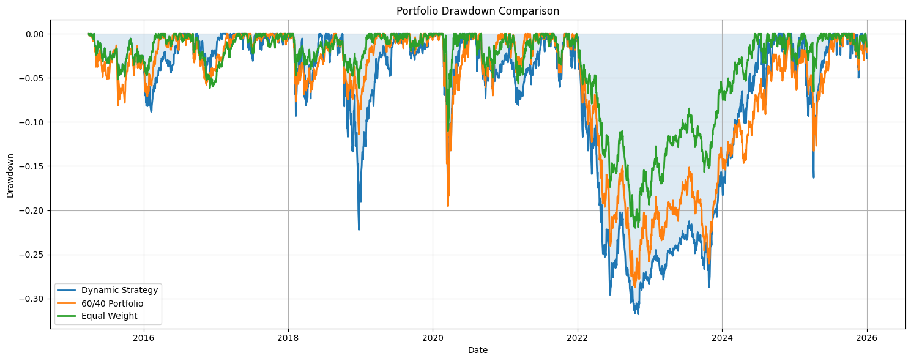
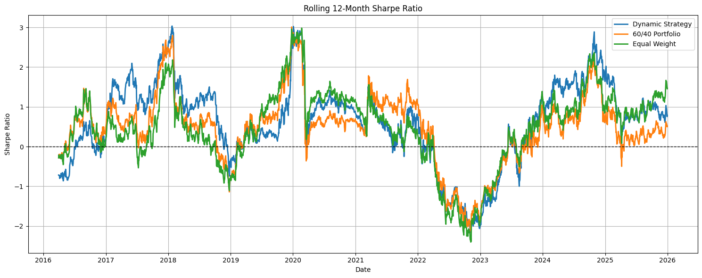
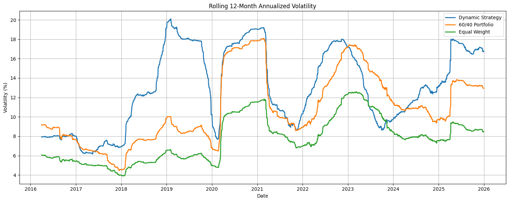
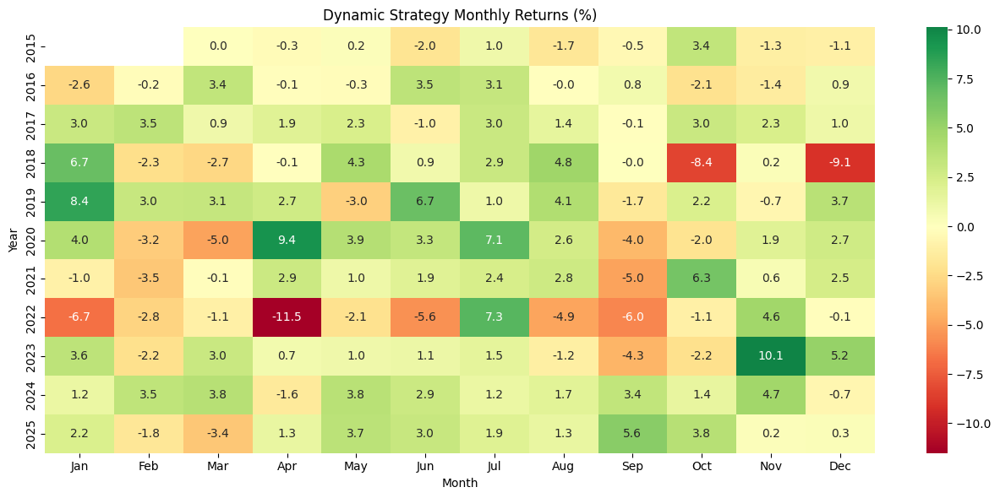
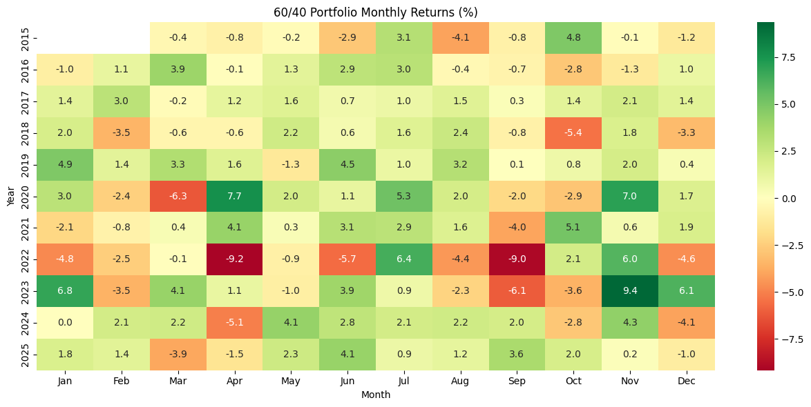
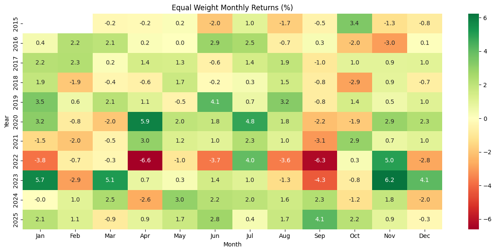

# Macro-Aware Tactical Asset Allocation Engine

A dynamic, HMM-driven regime-switching portfolio strategy that classifies hidden market states (**Bull / Bear / Crisis**) from multi-asset returns, VIX, and macroeconomic indicators, then re-optimizes allocations across equities, bonds, and gold under regime-specific risk and turnover constraints. Built as a full walk-forward pipeline — data ingestion → feature engineering → regime detection → convex optimization → backtesting → benchmarking → performance reporting — with explicit safeguards against look-ahead bias and portfolio thrashing.

| | |
|---|---|
| **Assets** | SPY, QQQ, TLT, IEF, GLD, SHY |
| **Benchmarks** | 60/40 (SPY/TLT), Equal Weight |
| **Rebalancing** | Monthly |
| **Backtest Period** | 2015-03 → 2025-12 (after a 5-year initial training window) |
| **Hidden States** | 3 (Bull, Bear, Crisis) |

---

## Goals Compliance

| Goal | Status | Notes |
|---|---|---|
| HMM regime classifier (no manual labelling) | ✅ | 3-state Gaussian HMM, states dynamically mapped to Bull/Bear/Crisis via mean VIX and equity return |
| Dynamic constraint mapping by regime | ✅ | Risk aversion, max weight, and turnover budget all vary by detected regime |
| Walk-forward validation, no look-ahead | ✅ | Expanding-window HMM retraining, regime signal shifted forward 1 period, weights applied from T+1 |
| Transaction friction modelling | ✅ | 5 bps/trade, L1 turnover penalty + hard turnover cap |
| Benchmarked vs. static portfolios | ✅ | 60/40 and Equal Weight, computed over the identical trading window |
| Full tear sheet (Sharpe/Sortino/Calmar/turnover) | ✅ | See Results below |
| Documented transition probabilities | ✅ | See Regime Detection Quality below |

---

## Getting Started

1. **Clone the repo**
   ```bash
   git clone https://github.com/Vineet-19/Quant-RegimeShift.git
   cd Quant-RegimeShift
   ```
2. **Install dependencies**
   ```bash
   pip install -r Requirements.txt
   ```
3. **Set up your FRED API key** — get a free key at https://fred.stlouisfed.org/docs/api/api_key.html, then set it in `config.py`:
   ```python
   FRED_API_KEY = "your_API_key_here"
   ```
4. **Run the notebook**
   ```bash
   jupyter notebook regimeshift.ipynb
   ```
   Restart Kernel → Run All for a clean, reproducible run. All outputs (weights, regimes, equity curves, transition matrix, drawdowns, rolling metrics) are written to `results/` as CSVs.

---

## Methodology

### 1. Data & Features
- Daily prices for six assets (SPY, QQQ, TLT, IEF, GLD, SHY) and VIX via `yfinance`; CPI, Fed funds rate, and 2Y/10Y Treasury yields via FRED.
- Macro series are **lagged before use** (CPI ~1 month, yields 1 day) to reflect real-world publication delays — the model never sees macro data before it was actually available.
- HMM input features: `SPY_Return`, `TLT_Return`, `GLD_Return`, `VIX_Change`, `Yield_Spread`, `SPY_Volatility`.

### 2. Regime Detection (HMM)
- `GaussianHMM` with **3 hidden states** and **diagonal covariance** (chosen after testing — `full` overfit on ~5 years of daily data, `tied` collapsed the volatility signal needed to separate Bull from Bear).
- Retrained every 3 months on an **expanding window** (all data strictly before the retrain date).
- Fit with **5 random restarts per retrain**, keeping the highest-likelihood solution, to avoid EM converging to a local optimum.
- Raw HMM state indices are arbitrary each retrain, so states are **dynamically remapped** to Bull/Bear/Crisis using each state's mean VIX (highest → Crisis) and mean SPY return (higher of the remaining two → Bull) — never a fixed index-to-label assumption.
- A **2-month confirmation rule** (1-month for Crisis) is applied before accepting a regime switch, reducing whipsaw from single-month noise while still reacting fast to genuine risk-off events.

### 3. No Look-Ahead Bias
- Monthly regime signals are **shifted forward by one period** before being applied — a regime detected using data through month-end T only affects allocations from month T+1 onward.
- The optimizer's expected-return and covariance estimates use only data strictly before the rebalance date.
- The backtest applies newly computed weights starting the **trading day after** the rebalance decision, not the same day — closing a subtle same-day leak where a decision would otherwise "earn" the very return used to make it.

### 4. Regime-Aware Optimization
At each rebalance, a convex mean-variance problem (`cvxpy` + OSQP) is solved per regime:
- **Expected returns**: blended between a regime-conditional EWMA and the long-run average return, shrunk harder in Bear/Crisis to avoid overreacting to noisy short-term signals.
- **Covariance**: Ledoit-Wolf shrinkage estimator, blended with a downside-only (semivariance) estimate so the optimizer is penalized more for co-crash risk than general volatility.
- **Risk aversion (γ), max single-asset weight, and turnover budget all vary by regime** — loose in Bull to allow concentration in winners, tight in Bear/Crisis to control risk.
- **Turnover friction**: an L1 penalty plus a hard turnover cap, jointly controlling trading costs and preventing corner-solution thrashing between rebalances.
- **Crisis defensive floor**: a minimum combined allocation to SHY/IEF/GLD is enforced during Crisis regimes.

### 5. Benchmarking
60/40 and Equal Weight portfolios are computed over the **exact same window the dynamic strategy trades** (2015-03 onward), avoiding an unfair comparison where benchmarks would otherwise get extra years of compounding the strategy never participated in.

---

## Results (2015-03 → 2025-12)

| Metric | Dynamic Strategy | 60/40 Portfolio | Equal Weight |
|---|---|---|---|
| Final Value | **$2,808,379.80** | $2,027,869.86 | $2,088,170.74 |
| Cumulative Return | **180.84%** | 103.68% | 109.33% |
| CAGR | **10.09%** | 6.85% | 7.12% |
| Annual Volatility | 13.41% | 11.31% | 7.94% |
| Sharpe Ratio | **0.454** | 0.252 | 0.393 |
| Sortino Ratio | **0.553** | 0.316 | 0.524 |
| Maximum Drawdown | -31.81% | -28.74% | **-22.01%** |
| Calmar Ratio | 0.317 | 0.238 | **0.324** |
| Average Turnover | 22.04% | – | – |

*(Sharpe/Sortino computed on excess returns over a 4% risk-free rate.)*

**Takeaways:** the strategy outperforms both static benchmarks on CAGR, Sharpe, and Sortino net of transaction costs. Its one clear weakness is maximum drawdown, concentrated almost entirely in the 2022 "everything sells off together" period — a slow, correlated Bear-regime drawdown (not a VIX-driven Crisis spike), where the strategy's Crisis-only defensive floor doesn't engage. See **Future Planned Improvements** below.



### Regime Detection Quality

Latest HMM transition matrix (rows = current state, columns = next state):

| | Bull | Bear | Crisis |
|---|---|---|---|
| **Bull** | 0.9756 | 0.0000 | 0.0244 |
| **Bear** | 0.0000 | 0.9873 | 0.0127 |
| **Crisis** | 0.0610 | 0.0304 | 0.9087 |

All three regimes show strong diagonal persistence (>90%), confirming the model captures genuine, sticky market states rather than noise. Across the full backtest: **51 Crisis, 40 Bull, 39 Bear** rebalance checkpoints.




### Portfolio Allocation

Regime-driven rotation between equities (SPY/QQQ), duration (TLT/IEF), gold, and cash-equivalent (SHY) over time:



### Drawdown & Rolling Risk





No single period drives all the outperformance — the edge is broadly distributed across the sample, not a one-time lucky trade — while the drawdown chart makes the 2022 underperformance versus Equal Weight clearly visible.

### Monthly Returns

<table>
<tr><td></td>
<td></td>
<td></td></tr>
</table>

> **Note on images above:** save the corresponding chart PNGs into an `assets/` folder in the repo root with the filenames referenced above (`portfolio_value_comparison.png`, `detected_regimes.png`, `spy_with_regimes.png`, `portfolio_allocation.png`, `drawdown_comparison.png`, `rolling_sharpe.png`, `rolling_volatility.png`, `heatmap_dynamic.png`, `heatmap_6040.png`, `heatmap_equal.png`) — GitHub will then render them inline automatically.

---

## Repository Structure
```
├── regimeshift.ipynb          # Full pipeline: data → HMM → optimization → backtest → reporting
├── Requirements.txt
├── config.py                  # FRED_API_KEY — see setup step 3
├── results/                   # Generated on run: CSVs (weights, regimes, returns, drawdowns, etc.)
├── assets/                    # Chart images referenced in this README
└── README.md
```

## Future Planned Improvements

- **Bear-regime tail protection**: extend the defensive floor beyond Crisis to slow, correlated Bear-regime drawdowns like 2022, without reintroducing the turnover-constraint infeasibilities observed when this was first attempted.
- **Strict in-sample/out-of-sample split**: finalize all regime-specific parameters (γ, weight caps, turnover budgets) using one sub-period (e.g., through 2021) and report a later window as a genuinely untouched holdout, to more rigorously rule out parameter overfitting to this specific historical path.
- **Richer regime features**: incorporate credit spreads, market breadth, or cross-asset correlation measures to sharpen Bull/Bear separation beyond the current six-feature set.
- **More granular regime taxonomy**: test 4–5 hidden states to see if an intermediate "late-cycle" or "recovery" state improves allocation decisions around regime transitions.
- **Alternative optimizers**: compare the current mean-variance formulation against risk-parity or Black-Litterman-style allocation within each regime.
- **Automated retraining cadence tuning**: test whether a shorter/longer HMM retraining interval (currently 3 months) changes regime detection latency and downstream performance.

## Tech Stack
Python 3.9+ · `hmmlearn` · `cvxpy` · `pandas` / `numpy` · `scikit-learn` (Ledoit-Wolf, StandardScaler) · `matplotlib` / `seaborn` · `yfinance` · `fredapi`
